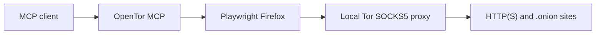

# OpenTor MCP

> A local MCP server that gives AI assistants a supervised Firefox session routed through Tor.

[](https://github.com/Medamine-cheddadi/opentor-mcp/actions/workflows/ci.yml)

[](LICENSE)


OpenTor MCP connects an MCP-compatible client to Playwright Firefox through a local Tor
SOCKS5 proxy. It can browse HTTP(S) and `.onion` pages, return readable content and native
screenshots, extract forum data, preserve sessions, and archive pages for offline review.

It is designed as a small, local-first side project for supervised research and experimentation.
It is **not Tor Browser**, does not reproduce Tor Browser's fingerprint, and does not guarantee
anonymity.

## Why this project?

- **MCP-native** — 27 focused tools with native image results and safety annotations.
- **Local-first** — the browser, Tor connection, cookies, archives, and optional OCR stay on your
  machine.
- **Useful output** — page markdown, links, metadata, screenshots, forum threads, and posts.
- **Secure defaults** — JavaScript evaluation and invalid TLS certificates are disabled by default.
- **Bounded responses** — pagination and output budgets keep large pages from overwhelming clients.

## How it works



The MCP server uses one shared browser context and serializes browser operations so concurrent tool
calls cannot race the active page.

## Quick start

OpenTor MCP currently targets macOS and Linux. You need Python 3.11 or newer and `curl`. The
installer can install and start Tor with Homebrew, `apt`, or `dnf`; it may ask for `sudo` on Linux.

```bash
git clone https://github.com/Medamine-cheddadi/opentor-mcp.git
cd opentor-mcp
chmod +x install.sh
./install.sh
```

The installer creates `.venv`, installs Playwright Firefox, checks the Tor SOCKS port, and prints an
MCP configuration using absolute paths. It uses the lockfile when `uv` is available and prints a
warning before falling back to an unlocked `pip` install.

To include the heavier `ddddocr` dependency during installation, opt in explicitly:

```bash
TOR_MCP_INSTALL_OCR=true ./install.sh
```

### Manual setup with uv

[Install uv](https://docs.astral.sh/uv/getting-started/installation/) and start Tor first, then run:

```bash
git clone https://github.com/Medamine-cheddadi/opentor-mcp.git
cd opentor-mcp
uv sync --locked
uv run playwright install firefox              # macOS
uv run playwright install --with-deps firefox  # Linux; may install system packages
```

Optional local CAPTCHA OCR is deliberately separate from the core installation:

```bash
uv sync --locked --extra ocr          # ddddocr

# Tesseract requires both the system executable and Python bindings:
brew install tesseract                # macOS
sudo apt install tesseract-ocr        # Debian/Ubuntu
uv sync --locked --extra tesseract
```

## Connect an MCP client

Use an absolute path to the virtual environment created inside the repository.

### Claude Code

The official Claude Code CLI can register the stdio server directly:

```bash
claude mcp add \
  --scope user \
  --env TOR_SOCKS_PORT=9050 \
  --env TOR_CONTROL_PORT=9051 \
  --env TOR_MCP_DIR=/absolute/path/opentor-mcp \
  --env TOR_ALLOW_JAVASCRIPT=false \
  --env TOR_IGNORE_HTTPS_ERRORS=false \
  --transport stdio opentor-mcp -- \
  /absolute/path/opentor-mcp/.venv/bin/tor-mcp

claude mcp list
```

The example uses user scope so the server is available across your Claude Code projects. For a
narrower setup, use `--scope local` and run the command from each project that should access it.

See the [Claude Code MCP documentation](https://code.claude.com/docs/en/mcp) for scope and
configuration options.

### Generic stdio configuration

Other clients use different configuration files and formats. For clients that accept the common
JSON `mcpServers` shape, use:

```json
{
  "mcpServers": {
    "opentor-mcp": {
      "command": "/absolute/path/opentor-mcp/.venv/bin/tor-mcp",
      "env": {
        "TOR_SOCKS_PORT": "9050",
        "TOR_CONTROL_PORT": "9051",
        "TOR_HEADLESS": "true",
        "TOR_MCP_DIR": "/absolute/path/opentor-mcp",
        "TOR_ALLOW_JAVASCRIPT": "false",
        "TOR_IGNORE_HTTPS_ERRORS": "false"
      }
    }
  }
}
```

Restart your MCP client after adding the server. A few safe prompts to try:

Screenshot and CAPTCHA workflows require a client that can render native MCP image content.

```text
Check whether my browser traffic is using Tor.
Open the DuckDuckGo onion service and search for Tor Project documentation.
Read the current page and return a short summary with its links.
Take a screenshot of the current viewport.
```

## Tools (27 total)

<details>
<summary><strong>All 27 tools</strong></summary>

### Navigation

| Tool | Description |
| --- | --- |
| `tor_navigate` | Navigate to an allowed HTTP(S) URL, including `.onion` addresses |
| `tor_back` | Go back in browser history |
| `tor_forward` | Go forward in browser history |
| `tor_refresh` | Reload the active page |

### Reading

| Tool | Description |
| --- | --- |
| `tor_read_page` | Return bounded page content as markdown |
| `tor_screenshot` | Return a viewport or full-page screenshot as native MCP image content |
| `tor_screenshot_element` | Return a selected element as native MCP image content |
| `tor_get_links` | Return a paginated list of page links |
| `tor_get_page_info` | Return page metadata and element counts |
| `tor_query_elements` | Query DOM elements with a CSS selector |

### Interaction

| Tool | Description |
| --- | --- |
| `tor_click` | Click an element |
| `tor_type` | Clear and type into an input |
| `tor_press_key` | Press a keyboard key |
| `tor_scroll` | Scroll up, down, to the top, or to the bottom |
| `tor_evaluate_js` | Evaluate page JavaScript when explicitly enabled |

### Search and extraction

| Tool | Description |
| --- | --- |
| `tor_search` | Search with Ahmia, Torch, DuckDuckGo, or Haystack |
| `tor_extract_threads` | Extract paginated forum thread listings |
| `tor_extract_posts` | Extract paginated forum posts |

### CAPTCHA assistance

| Tool | Description |
| --- | --- |
| `tor_get_captcha` | Capture a CAPTCHA for client vision with an optional OCR hint |
| `tor_solve_captcha` | Attempt local OCR and fill the result when available |

### Sessions

| Tool | Description |
| --- | --- |
| `tor_save_session` | Store cookies in an owner-only local file |
| `tor_load_session` | Restore cookies from a saved session |
| `tor_list_sessions` | List saved session metadata without exposing cookie values |
| `tor_delete_session` | Delete a saved session |

### Tor control and archiving

| Tool | Description |
| --- | --- |
| `tor_new_identity` | Request a new Tor circuit and clear browser cookies |
| `tor_check_connection` | Check the Tor exit IP without replacing the active page |
| `tor_archive_page` | Save a private page snapshot beneath the configured archive root |

</details>

## CAPTCHA assistance

The primary flow returns a CAPTCHA as native MCP image content so a vision-capable client can read
it. If installed, `ddddocr` or Tesseract can provide a local hint and optionally fill the answer.
OCR is best-effort and the image is preserved when OCR fails.

Only use CAPTCHA assistance on services you are authorized to access and in ways permitted by their
rules. The feature is not intended for bulk bypass or abusive automation.

## Sessions and archives

Saved sessions contain authentication cookies and must be treated as credentials. Session names use
the strict pattern `^[A-Za-z0-9][A-Za-z0-9_-]{0,63}$`; directories are created with mode `0700` and
files with mode `0600` on supported systems.

```text
tor_save_session(name="research-forum")
tor_load_session(name="research-forum")
```

Archives contain raw HTML, text, metadata, and a screenshot. They remain untrusted even when opened
offline. Session and archive directories are ignored by Git.

## Configuration

| Variable | Default | Description |
| --- | --- | --- |
| `TOR_SOCKS_PORT` | `9050` | Local Tor SOCKS5 port |
| `TOR_CONTROL_PORT` | `9051` | Authenticated Tor control port used for `NEWNYM` |
| `TOR_CONTROL_PASSWORD` | unset | Optional control password; cookie authentication is used otherwise |
| `TOR_HEADLESS` | `true` | Run Firefox without a visible window |
| `TOR_MCP_DIR` | current directory | Base directory for private sessions and archives |
| `TOR_ALLOW_JAVASCRIPT` | `false` | Enable the high-risk `tor_evaluate_js` tool |
| `TOR_IGNORE_HTTPS_ERRORS` | `false` | Accept invalid TLS certificates for every destination |
| `TOR_MAX_RESPONSE_CHARS` | `50000` | Maximum characters returned by a text tool |
| `TOR_MAX_ITEM_LIMIT` | `100` | Maximum items returned by paginated tools |
| `TOR_MAX_IMAGE_BYTES` | `5000000` | Maximum raw screenshot or CAPTCHA size |
| `TOR_MAX_JSON_FIELD_CHARS` | `4096` | Maximum retained characters in one web-derived JSON field |

Circuit rotation requires an authenticated Tor control port. A minimal cookie-authentication setup
in `torrc` is:

```text
ControlPort 9051
CookieAuthentication 1
```

Restart Tor after changing its configuration. Browsing still works when the control port is
unavailable, but `tor_new_identity` cannot request a new circuit.

## Security model

- Every browser HTTP(S) request is checked against the URL policy, including redirects and
  page-initiated requests.
- Direct navigation accepts only absolute HTTP(S) URLs, so navigation to local files is rejected.
- The HTTP(S) request gate rejects embedded credentials, localhost, non-ASCII host aliases, and
  private, loopback, reserved, or link-local IP destinations.
- Page-derived text is labeled as untrusted and JSON responses use an
  `{ "untrusted": true, "data": ... }` envelope.
- `TOR_ALLOW_JAVASCRIPT` gates the arbitrary `tor_evaluate_js` tool only; JavaScript belonging to
  visited websites remains enabled in Firefox.
- Invalid TLS certificates require explicit opt-in.
- Screenshot, text, field, and item budgets constrain MCP response size.
- Browser operations are serialized and Playwright resources are closed with the MCP lifecycle.

Please report vulnerabilities privately as described in [SECURITY.md](SECURITY.md).

## Limitations

- OpenTor MCP uses stock Playwright Firefox through Tor. It is not Tor Browser and does not provide
  Tor Browser's fingerprinting defenses or anonymity guarantees.
- The server owns one shared browser context. It is intended for one trusted local operator, not as
  a multi-user hosted service.
- Forum extraction is heuristic and site layouts can change without notice.
- Onion services and bundled search providers may be unavailable or change addresses.
- To preserve Tor's remote DNS behavior, OpenTor MCP does not resolve public hostnames locally before
  navigation. The request gate rejects literal and browser-normalized local IP forms, not a public
  hostname based on its future DNS answer.
- The automated test suite uses fakes; live Tor connectivity remains an explicit local smoke test.

## Development

```bash
uv sync --locked --extra dev
uv run ruff format --check src tests
uv run ruff check .
uv run pyright src
uv run pytest --cov=tor_mcp --cov-report=term-missing
uv run python -m build
uv run pip-audit
```

The test suite must remain network-free and maintain at least 80% branch coverage. See
[CONTRIBUTING.md](CONTRIBUTING.md) for the workflow and pull-request checklist.

## Responsible use

Use this project only for lawful, authorized research, testing, privacy work, or personal browsing.
You are responsible for complying with applicable laws, service terms, and data-handling rules. Do
not use it to access accounts or systems without permission, evade controls, or cause harm.

## License

Released under the [MIT License](LICENSE).
