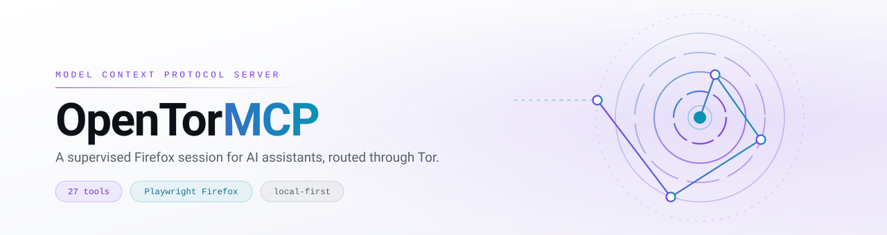
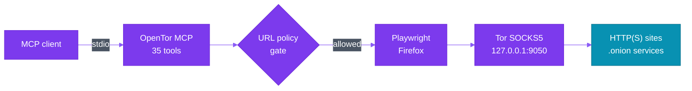

<div align="center">

<picture>
  <source media="(prefers-color-scheme: dark)" srcset="assets/banner-dark.svg">
  <source media="(prefers-color-scheme: light)" srcset="assets/banner-light.svg">
  
</picture>

<br>

[](https://github.com/Medamine-cheddadi/opentor-mcp/actions/workflows/ci.yml)
[](https://www.python.org/)
[](#tools)
[](LICENSE)
[](#limitations)

**[Quick start](#quick-start)** · **[Connect a client](#connect-an-mcp-client)** · **[Tools](#tools)** · **[Configuration](#configuration)** · **[Security](#security-model)** · **[Contributing](CONTRIBUTING.md)**

</div>

---

OpenTor MCP connects an MCP-compatible client to Playwright Firefox through a local Tor SOCKS5
proxy. It can browse HTTP(S) and `.onion` pages, return readable content and native screenshots,
extract forum data, preserve sessions, and archive pages for offline review.

It is designed as a small, local-first side project for supervised research and experimentation.

> [!WARNING]
> **This is not Tor Browser.** OpenTor MCP does not reproduce Tor Browser's fingerprint and does not
> guarantee anonymity. See [Limitations](#limitations) before relying on it for anything sensitive.

## Why OpenTor MCP

<table>
<tr>
<td width="50%" valign="top">

### MCP-native

35 focused tools with native image results and safety annotations — screenshots and CAPTCHAs come
back as real MCP image content, not base64 blobs in a text field.

</td>
<td width="50%" valign="top">

### Local-first

The browser, Tor connection, cookies, archives, and optional OCR all stay on your machine. Nothing
is relayed through a third-party service.

</td>
</tr>
<tr>
<td width="50%" valign="top">

### Secure by default

JavaScript evaluation and invalid TLS certificates are off unless you explicitly opt in. Every
request — including redirects — passes a URL policy gate.

</td>
<td width="50%" valign="top">

### Bounded responses

Pagination and output budgets keep a 4 MB page from flooding your client's context window.

</td>
</tr>
<tr>
<td width="50%" valign="top">

### Useful output

Page markdown, links, metadata, screenshots, forum threads, and posts — shaped for a model to read,
not a human to squint at.

</td>
<td width="50%" valign="top">

### Session-aware

Cookies save to owner-only local files, archives capture HTML + text + metadata + screenshot, and
circuits rotate on demand.

</td>
</tr>
</table>

## How it works



Every stage before the exit — client, server, policy gate, browser, and Tor proxy — runs on your own
machine. The server uses one shared browser context and serializes browser operations, so concurrent
tool calls cannot race the active page.

## Quick start

> **Requirements** — macOS or Linux, Python 3.11+, and `curl`. The installer can install and start
> Tor with Homebrew, `apt`, or `dnf`; it may ask for `sudo` on Linux.

```bash
git clone https://github.com/Medamine-cheddadi/opentor-mcp.git
cd opentor-mcp
chmod +x install.sh
./install.sh
```

The installer creates `.venv`, installs Playwright Firefox, checks the Tor SOCKS port, and prints an
MCP configuration using absolute paths. It uses the lockfile when `uv` is available and prints a
warning before falling back to an unlocked `pip` install.

To include the heavier `ddddocr` dependency during installation, opt in explicitly:

```bash
TOR_MCP_INSTALL_OCR=true ./install.sh
```

<details>
<summary><strong>Manual setup with uv</strong></summary>

<br>

[Install uv](https://docs.astral.sh/uv/getting-started/installation/) and start Tor first, then run:

```bash
git clone https://github.com/Medamine-cheddadi/opentor-mcp.git
cd opentor-mcp
uv sync --locked
uv run playwright install firefox              # macOS
uv run playwright install --with-deps firefox  # Linux; may install system packages
```

Optional local CAPTCHA OCR is deliberately separate from the core installation:

```bash
uv sync --locked --extra ocr          # ddddocr

# Tesseract requires both the system executable and Python bindings:
brew install tesseract                # macOS
sudo apt install tesseract-ocr        # Debian/Ubuntu
uv sync --locked --extra tesseract
```

</details>

## Connect an MCP client

Use an absolute path to the virtual environment created inside the repository.

### Claude Code

```bash
claude mcp add \
  --scope user \
  --env TOR_SOCKS_PORT=9050 \
  --env TOR_CONTROL_PORT=9051 \
  --env TOR_MCP_DIR=/absolute/path/opentor-mcp \
  --env TOR_ALLOW_JAVASCRIPT=false \
  --env TOR_IGNORE_HTTPS_ERRORS=false \
  --transport stdio opentor-mcp -- \
  /absolute/path/opentor-mcp/.venv/bin/tor-mcp

claude mcp list
```

The example uses user scope so the server is available across your Claude Code projects. For a
narrower setup, use `--scope local` and run the command from each project that should access it. See
the [Claude Code MCP documentation](https://code.claude.com/docs/en/mcp) for scope and configuration
options.

### Generic stdio configuration

Other clients use different configuration files and formats. For clients that accept the common JSON
`mcpServers` shape:

```json
{
  "mcpServers": {
    "opentor-mcp": {
      "command": "/absolute/path/opentor-mcp/.venv/bin/tor-mcp",
      "env": {
        "TOR_SOCKS_PORT": "9050",
        "TOR_CONTROL_PORT": "9051",
        "TOR_HEADLESS": "true",
        "TOR_MCP_DIR": "/absolute/path/opentor-mcp",
        "TOR_ALLOW_JAVASCRIPT": "false",
        "TOR_IGNORE_HTTPS_ERRORS": "false"
      }
    }
  }
}
```

### First prompts

Restart your MCP client after adding the server, then try:

```text
Check whether my browser traffic is using Tor.
Open the DuckDuckGo onion service and search for Tor Project documentation.
Read the current page and return a short summary with its links.
Take a screenshot of the current viewport.
```

Screenshot and CAPTCHA workflows require a client that can render native MCP image content.

## Tools

| Category | Count | What it covers |
| --- | :---: | --- |
| **Navigation** | 4 | Move between pages and through history |
| **Reading** | 6 | Markdown, screenshots, links, metadata, DOM queries |
| **Interaction** | 9 | Click, type, key press, scroll, element wait, optional JS, select, batch fill, checkbox |
| **Search and extraction** | 3 | Onion search engines and forum extraction |
| **CAPTCHA assistance** | 2 | Native image capture with optional local OCR |
| **Tab management** | 3 | Open, close, and list browser tabs |
| **Sessions** | 4 | Save, load, list, and delete cookie jars |
| **Downloads** | 1 | Download files through Tor with size and MIME filtering |
| **Tor control and archiving** | 4 | New circuit, circuit rotation, connection check, page snapshot |

<details>
<summary><strong>Tools (37 total) — full reference</strong></summary>

<br>

#### Navigation

| Tool | Description |
| --- | --- |
| `tor_navigate` | Navigate to an allowed HTTP(S) URL, including `.onion` addresses |
| `tor_back` | Go back in browser history |
| `tor_forward` | Go forward in browser history |
| `tor_refresh` | Reload the active page |

#### Reading

| Tool | Description |
| --- | --- |
| `tor_read_page` | Return bounded page content as markdown |
| `tor_screenshot` | Return a viewport or full-page screenshot as native MCP image content |
| `tor_screenshot_element` | Return a selected element as native MCP image content |
| `tor_get_links` | Return a paginated list of page links |
| `tor_get_page_info` | Return page metadata and element counts |
| `tor_query_elements` | Query DOM elements with a CSS selector |

#### Interaction

| Tool | Description |
| --- | --- |
| `tor_click` | Click an element |
| `tor_type` | Clear and type into an input |
| `tor_press_key` | Press a keyboard key |
| `tor_scroll` | Scroll up, down, to the top, or to the bottom |
| `tor_select_option` | Select a dropdown option by CSS selector and value |
| `tor_fill_form` | Fill multiple form fields in one call (batch) |
| `tor_toggle_checkbox` | Check or uncheck a checkbox |
| `tor_wait_for` | Wait for a CSS selector to appear on the current page |
| `tor_evaluate_js` | Evaluate page JavaScript when explicitly enabled |

#### Search and extraction

| Tool | Description |
| --- | --- |
| `tor_search` | Search with Ahmia, Torch, DuckDuckGo, or Haystack |
| `tor_extract_threads` | Extract paginated forum thread listings |
| `tor_extract_posts` | Extract paginated forum posts |
| `tor_extract_data` | Extract structured JSON from a page using a CSS selector schema |

#### CAPTCHA assistance

| Tool | Description |
| --- | --- |
| `tor_get_captcha` | Capture a CAPTCHA for client vision with an optional OCR hint |
| `tor_solve_captcha` | Attempt local OCR and fill the result when available |

#### Sessions

| Tool | Description |
| --- | --- |
| `tor_save_session` | Store cookies in an owner-only local file |
| `tor_load_session` | Restore cookies from a saved session |
| `tor_list_sessions` | List saved session metadata without exposing cookie values |
| `tor_delete_session` | Delete a saved session |

#### Tab management

| Tool | Description |
| --- | --- |
| `tor_open_tab` | Open a new browser tab and make it the active tab |
| `tor_close_tab` | Close a browser tab (cannot close the last remaining tab) |
| `tor_list_tabs` | List all open browser tabs with their URL and active status |

#### Tor control and archiving

| Tool | Description |
| --- | --- |
| `tor_new_identity` | Request a new Tor circuit and clear browser cookies |
| `tor_rotate_circuit` | Rotate the Tor circuit without clearing cookies (preserves sessions) |
| `tor_check_connection` | Check the Tor exit IP without replacing the active page |
| `tor_archive_page` | Save a private page snapshot beneath the configured archive root |

#### Downloads

| Tool | Description |
| --- | --- |
| `tor_download_file` | Download a file through Tor with size limits, MIME filtering, and filename sanitization |

</details>

## CAPTCHA assistance

The primary flow returns a CAPTCHA as native MCP image content so a vision-capable client can read
it. If installed, `ddddocr` or Tesseract can provide a local hint and optionally fill the answer. OCR
is best-effort, and the image is preserved when OCR fails.

> [!IMPORTANT]
> Only use CAPTCHA assistance on services you are authorized to access and in ways permitted by their
> rules. The feature is not intended for bulk bypass or abusive automation.

## Sessions and archives

Saved sessions contain authentication cookies and **must be treated as credentials**. Session names
use the strict pattern `^[A-Za-z0-9][A-Za-z0-9_-]{0,63}$`; directories are created with mode `0700`
and files with mode `0600` on supported systems.

```text
tor_save_session(name="research-forum")
tor_load_session(name="research-forum")
```

Archives contain raw HTML, text, metadata, and a screenshot. They remain untrusted even when opened
offline. Session and archive directories are ignored by Git.

## Configuration

| Variable | Default | Description |
| --- | --- | --- |
| `TOR_SOCKS_PORT` | `9050` | Local Tor SOCKS5 port |
| `TOR_CONTROL_PORT` | `9051` | Authenticated Tor control port used for `NEWNYM` |
| `TOR_CONTROL_PASSWORD` | unset | Optional control password; cookie authentication is used otherwise |
| `TOR_HEADLESS` | `true` | Run Firefox without a visible window |
| `TOR_MCP_DIR` | current directory | Base directory for private sessions and archives |
| `TOR_ALLOW_JAVASCRIPT` | `false` | Enable the high-risk `tor_evaluate_js` tool |
| `TOR_IGNORE_HTTPS_ERRORS` | `false` | Accept invalid TLS certificates for every destination |
| `TOR_COMPATIBILITY_MODE` | `false` | Relax select stealth prefs (service workers, canvas read) for JS-heavy sites |
| `TOR_MAX_RESPONSE_CHARS` | `50000` | Maximum characters returned by a text tool |
| `TOR_MAX_ITEM_LIMIT` | `100` | Maximum items returned by paginated tools |
| `TOR_MAX_IMAGE_BYTES` | `5000000` | Maximum raw screenshot or CAPTCHA size |
| `TOR_MAX_JSON_FIELD_CHARS` | `4096` | Maximum retained characters in one web-derived JSON field |
| `TOR_MAX_DOWNLOAD_BYTES` | `52428800` | Maximum file size for downloads (default 50 MB) |
| `TOR_ALLOWED_DOWNLOAD_TYPES` | see below | Comma-separated MIME types accepted by `tor_download_file` |

Circuit rotation requires an authenticated Tor control port. A minimal cookie-authentication setup in
`torrc` is:

```text
ControlPort 9051
CookieAuthentication 1
```

Restart Tor after changing its configuration. Browsing still works when the control port is
unavailable, but `tor_new_identity` cannot request a new circuit.

## Security model

- Every browser HTTP(S) request is checked against the URL policy, including redirects and
  page-initiated requests.
- Direct navigation accepts only absolute HTTP(S) URLs, so navigation to local files is rejected.
- The HTTP(S) request gate rejects embedded credentials, localhost, non-ASCII host aliases, and
  private, loopback, reserved, or link-local IP destinations.
- Page-derived text is labeled as untrusted, and JSON responses use an
  `{ "untrusted": true, "data": ... }` envelope.
- `TOR_ALLOW_JAVASCRIPT` gates the arbitrary `tor_evaluate_js` tool only; JavaScript belonging to
  visited websites remains enabled in Firefox.
- Invalid TLS certificates require explicit opt-in.
- Screenshot, text, field, and item budgets constrain MCP response size.
- Browser operations are serialized, and Playwright resources are closed with the MCP lifecycle.

Please report vulnerabilities privately as described in [SECURITY.md](SECURITY.md).

## Limitations

- OpenTor MCP uses stock Playwright Firefox through Tor. It is **not Tor Browser** and does not
  provide Tor Browser's fingerprinting defenses or anonymity guarantees.
- The server owns one shared browser context. It is intended for one trusted local operator, not as a
  multi-user hosted service.
- Forum extraction is heuristic, and site layouts can change without notice.
- Onion services and bundled search providers may be unavailable or change addresses.
- To preserve Tor's remote DNS behavior, OpenTor MCP does not resolve public hostnames locally before
  navigation. The request gate rejects literal and browser-normalized local IP forms, not a public
  hostname based on its future DNS answer.
- The automated test suite uses fakes; live Tor connectivity remains an explicit local smoke test.

## Development

```bash
uv sync --locked --extra dev
uv run ruff format --check src tests
uv run ruff check .
uv run pyright src
uv run pytest --cov=tor_mcp --cov-report=term-missing
uv run python -m build
uv run pip-audit
```

The test suite must remain network-free and maintain at least 80% branch coverage. See
[CONTRIBUTING.md](CONTRIBUTING.md) for the workflow and pull-request checklist.

## Responsible use

Use this project only for lawful, authorized research, testing, privacy work, or personal browsing.
You are responsible for complying with applicable laws, service terms, and data-handling rules. Do
not use it to access accounts or systems without permission, evade controls, or cause harm.

## License

Released under the [MIT License](LICENSE).

<div align="center">
<br>
<sub>Built for supervised, local-first research. Not affiliated with the Tor Project.</sub>
</div>
