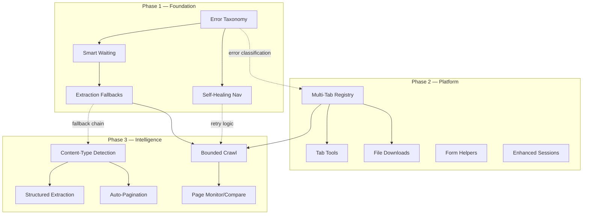

# feat: OpenTor MCP Comprehensive Improvements

## Overview

Improve OpenTor MCP across three phases — reliability, new capabilities, and intelligent composition — transforming it from a 27-tool alpha browser proxy into a robust research platform while preserving its local-first, privacy-oriented identity.

## Problem Frame

OpenTor MCP v0.1.0 users experience friction across three axes: **reliability** (JS-heavy pages don't render, extraction misses content, errors provide no recovery guidance), **capability gaps** (single-page browsing, no downloads, limited forms), and **usability** (common research workflows require many sequential tool calls). These compound — unreliable primitives make multi-step workflows fragile. (See origin: `docs/brainstorms/mcp-improvements-requirements.md`)

**Key insight from review:** R1's framing of JS rendering as a wait-strategy problem is partially incomplete — `STEALTH_PREFS` in `browser.py` disable APIs (WebGL, service workers, canvas, sensors) that some JS-heavy pages depend on. The plan addresses this via a configurable compatibility mode alongside wait strategies.

## Requirements Trace

### Phase 1 — Foundation (Reliability)

- R1. Smart page waiting — configurable wait strategies with intelligent defaults
- R2. Robust extraction fallbacks — formal fallback chain with quality scoring
- R3. Self-healing navigation — auto-retry with circuit rotation, configurable budget
- R4. Rich error context — actionable errors distinguishing transient vs permanent

### Phase 2 — Platform (New Capabilities)

- R5. Multi-tab browsing — multiple Pages, optional tab_id on all content tools
- R6. File downloads — size limits, MIME filtering, filename sanitization, proxy-leak gate
- R7. Form interaction helpers — batch fill, select, checkbox/radio
- R8. Enhanced session management — metadata fields, opt-in auto-save, load-with-navigate

### Phase 3 — Intelligence (Smart Composition)

- R9. Structured data extraction — schema-driven JSON extraction from pages
- R10. Auto-pagination — follow "next" links, aggregate, configurable limits
- R11. Content-type detection — classify pages, auto-select extraction strategy
- R12. Workflow tools — bounded same-origin crawl, page monitoring, page comparison

## Scope Boundaries

- Not a Tor Browser replacement — no fingerprint replication or anonymity guarantees
- No autonomous crawling — R12 bounded crawl requires mandatory depth/page limits
- No proxy management — external Tor daemon remains a prerequisite
- No browser GUI — all interaction through MCP tool calls
- Single operator model — multi-tab serves one operator's parallel research
- Implementation code is not prescribed — units describe approach and decisions, not exact code

### Deferred to Separate Tasks

- Phase 3 scope may be revisited after Phase 1 ships and real usage data validates demand (see origin review finding: "Phases 2-3 solve hypothetical demand")
- CLAUDE.md / AGENTS.md creation for the project — useful but not part of this feature work

## Context & Research

### Relevant Code and Patterns

- **Tool registration:** `@mcp.tool()` + `@serialized_browser_tool` decorator pattern in `server.py`
- **Annotation presets:** 6 `ToolAnnotations` constants — every new tool needs one
- **Singleton getters:** `get_browser()`, `get_captcha()`, `get_sessions()` — lazy construction from env vars
- **File safety:** `_write_private_file()` with `O_NOFOLLOW`, `0o600`, symlink rejection in `browser.py`; atomic writes via `tempfile.mkstemp()` + `os.replace()` in `sessions.py`
- **Name validation:** `SAFE_NAME_PATTERN = r'^[A-Za-z0-9][A-Za-z0-9_-]{0,63}$'` shared across modules
- **URL policy gate:** `validate_navigation_url()` + `_guard_navigation_request()` route interceptor
- **Multi-page proof:** `check_tor_connection()` already creates a second `Page` on the shared `BrowserContext`
- **Vestigial lock:** `browser.operation_lock` (instance `asyncio.Lock`) defined but never used — candidate for repurposing
- **Extraction strategies:** 3-tier heuristic in `extract_forum_threads()` — pattern to generalize
- **Existing unexposed methods:** `wait_for(selector, timeout)`, `select_option(selector, value)`, `rotate_circuit()`
- **Blocking I/O wrapping:** `asyncio.to_thread()` for Stem control calls
- **Config pattern:** env vars with `max(1, int(...))` defaults in `server.py`
- **Gitignored crawlers:** `crawler_v2.py`, `crawler_v3.py` contain working circuit rotation cadence (`ROTATE_EVERY=40`), adaptive backoff (`BASE_DELAY=2.0`, `BACKOFF_DELAY=8.0`), and bounded crawl logic

### Testing Conventions

- No pytest-asyncio — use `def run(coro): return asyncio.run(coro)` helper
- Hand-rolled fakes (`FakePage`, `FakeContext`) — no heavy mocking libraries
- `monkeypatch.setattr()` on singletons for injection
- `@pytest.mark.parametrize` for edge case sweeps
- Contract tests in `test_project_contract.py` enforce tool count, README accuracy, annotation presence
- Branch coverage ≥ 80% enforced by CI
- Test-first workflow per CONTRIBUTING.md

## Key Technical Decisions

- **Wait strategy default:** Change from `"domcontentloaded"` + 1000ms sleep to `"networkidle"` with configurable timeout. **Validated against real .onion sites:** DuckDuckGo .onion (React app) renders visually with current approach but extraction pulls raw JS because `page.content()` captures DOM before hydration completes. `networkidle` would delay extraction until after JS hydration settles. Ahmia .onion static content extracts cleanly with current approach. Tor Project clearnet extracts perfectly. The primary extraction quality issue is timing (extracting pre-hydration), not STEALTH_PREFS blocking rendering. (See origin R1)
- **Compatibility mode for STEALTH_PREFS:** Add `TOR_COMPATIBILITY_MODE` env var that relaxes select stealth prefs (service workers, canvas read) for sites that need them. Disabled by default to preserve privacy. Addresses the review finding that wait strategies alone won't fix pages broken by disabled browser APIs.
- **Error taxonomy:** Classify errors as `transient` (timeout, connection reset, circuit failure — retry-worthy) or `permanent` (element not found, URL blocked, invalid input — don't retry). Structured error format includes category, suggestion, and retryable flag.
- **Retry strategy:** Self-healing retries use `rotate_circuit()` (preserves cookies) by default. After all rotation retries are exhausted, do NOT auto-escalate to `new_identity()` — instead surface a suggestion to manually call `tor_new_identity` if the user wants a clean start (auto-escalation would silently clear cookies and break authenticated sessions). Default: max 2 retries with exponential backoff (2s, 4s). Configurable via `TOR_MAX_RETRIES` and `TOR_RETRY_BACKOFF`.
- **Failed rotation handling:** If `rotate_circuit()` fails (control port unreachable), the failed rotation counts against the retry budget and the retry proceeds without rotation. The error surfaces the control port issue as a configuration warning.
- **Extraction fallback terminal behavior:** When all strategies produce poor output, return the best result found (even if short) with a quality warning in the response metadata, not an error. The AI can then decide whether to retry with different parameters.
- **Tab management:** Tab registry as `dict[str, Page]` on `TorBrowser`. Default tab named `"main"`. Tab IDs are user-assigned strings validated by `SAFE_NAME_PATTERN`. Global lock kept initially — per-tab locking deferred to a future optimization pass after benchmarking.
- **R12 crawl locking:** The bounded crawl releases and re-acquires the global lock between each page navigation, preventing lock monopolization. Other tools can interleave.
- **Tool count management:** Minimize new tools through consolidation — content-type detection merged into `tor_get_page_info`, wait strategies as parameters on existing navigation tools. Target: ~40 total tools (from 27), not 50+.
- **Expose `rotate_circuit` as tool:** Add `tor_rotate_circuit` alongside existing `tor_new_identity` — operators currently have no way to rotate circuits without clearing cookies.
- **R2/R11 relationship:** R2 (Phase 1) builds the general fallback chain mechanism. R11 (Phase 3) adds a classification layer that selects the optimal *primary* strategy, which then feeds into R2's chain as the first attempt. They compose, not conflict.
- **R8 auto-save:** Opt-in per session (not global). Trigger: successful navigation to a new domain. Retention: auto-saved sessions expire after 7 days unless manually saved.
- **Phase 3 framing:** These tools are round-trip optimizations for common research patterns, not replacements for AI orchestration. The AI can always orchestrate manually using existing primitives.

## Real-World Validation (2026-08-13)

Tested against live .onion and clearnet sites through Tor to validate key plan decisions:

| Site | Type | Navigation | Extraction Quality | Key Finding |
|------|------|-----------|-------------------|-------------|
| DuckDuckGo .onion | JS-heavy React SPA | ✅ Loads, title extracted | ❌ Pulls raw JS source | Page renders visually (screenshot) but `page.content()` captures pre-hydration DOM. `networkidle` wait would fix this. |
| Ahmia .onion | Partial JS | ✅ Static content loads | ⚠️ Static OK, search 0 results | Search requires JS. HTTP→HTTPS redirect caused connection failure; tool returned stale content instead of error. |
| Tor Project clearnet | Static HTML | ✅ Fast, clean | ✅ Excellent markdown | Static sites extract perfectly with current approach. |

**Validated decisions:**
- **networkidle is the right default** — DuckDuckGo renders visually (STEALTH_PREFS don't block React) but extraction reads pre-hydration DOM. `networkidle` delays extraction until JS settles.
- **R4 (rich errors) is critical** — Ahmia search returned stale page content when the actual page was a Firefox "Unable to connect" error. No error detection, no retry.
- **R3 (self-healing) confirmed needed** — `tor_search` hit a transient "execution context destroyed" error with no retry or recovery guidance.
- **R2 (extraction fallbacks) confirmed needed** — DuckDuckGo extraction scored raw JS as "content." A quality heuristic would detect low text-to-boilerplate ratio and try alternatives.
- **R11 (content-type detection) confirmed useful** — Error page, search input, article all returned the same way with no classification.
- **STEALTH_PREFS are NOT the primary JS issue** — DuckDuckGo React and Ahmia both render visually. The problem is extraction timing, not disabled browser APIs. Compatibility mode is still useful for edge cases but is lower priority than wait strategy improvements.

## Open Questions

### Resolved During Planning

- **Playwright wait strategies:** Natively supports `"load"`, `"domcontentloaded"`, `"networkidle"`, and `"commit"` as `wait_until` options on `page.goto()`. Custom element waiting via `page.wait_for_selector()`. Both available without custom implementation.
- **Multi-page through SOCKS5:** Already proven by `check_tor_connection()` which creates a second `Page` on the shared `BrowserContext` through the Tor proxy. No verification needed.
- **Locking strategy:** Keep global serialization initially. The vestigial `browser.operation_lock` can be removed — the module-level `_browser_operation_lock` in server.py is the single source of truth.
- **R12 "internal links" scoping:** Defined as same scheme+host (or same .onion address) as the crawl's starting URL. Cross-origin links excluded from traversal.

### Deferred to Implementation

- **Playwright download through SOCKS5:** `context.on("download")` event handling through a SOCKS5 proxy needs runtime verification. If it doesn't fire, fallback to response body interception.
- **Extraction library additions:** Whether to add `trafilatura` or `readability-lxml` as optional extraction engines — depends on quality improvement in real testing.
- **R9 schema format specifics:** Start with simple `{field_name: css_selector}` dict; extend to support XPath and description-based extraction if CSS proves insufficient during implementation.
- **R10 pagination detection reliability on .onion sites:** Heuristics may not generalize — implementation should start with `link[rel="next"]` and `a` text matching ("Next", "→", page numbers) and iterate.
- **Optimal STEALTH_PREFS to relax in compatibility mode:** Needs testing against real JS-heavy sites to determine which specific prefs cause the most breakage.

## High-Level Technical Design

> *This illustrates the intended approach and is directional guidance for review, not implementation specification. The implementing agent should treat it as context, not code to reproduce.*



**Data flow for self-healing navigation (R3+R4):**

```
tor_navigate(url, wait_strategy)
  → validate_navigation_url(url)
  → retry_loop(max_retries, backoff):
      → page.goto(url, wait_until=strategy)
      → on timeout/connection_reset:
          classify_error() → transient
          rotate_circuit()  # preserves cookies
          continue retry_loop
      → on rotation_failure:
          count against budget, retry without rotation
          surface control-port warning
      → on permanent_error:
          return structured_error(category="permanent", suggestion="...")
  → wait_for_selector(selector) if specified
  → return success with page metadata
```

**Tab registry structure (R5):**

```
TorBrowser:
  _tabs: dict[str, Page]     # tab_id → Playwright Page
  _active_tab: str            # current active tab ID
  _max_tabs: int              # configurable bound (default 5)

  open_tab(tab_id) → Page     # creates new Page on shared BrowserContext
  switch_tab(tab_id) → Page   # sets _active_tab
  close_tab(tab_id)           # closes Page, removes from registry
  get_page(tab_id=None) → Page  # returns _tabs[tab_id or _active_tab]
```

**Extraction fallback chain (R2):**

```
extract_content(html, strategy_hint=None):
  strategies = [
    (strategy_hint or best_default),  # R11 classification feeds here
    markdownify_strategy,
    beautifulsoup_strategy,
    raw_text_strategy,                # terminal fallback
  ]
  best_result = None
  for strategy in strategies:
    result = strategy(html)
    if quality_score(result) > threshold:
      return result
    if not best_result or quality_score(result) > quality_score(best_result):
      best_result = result
  return best_result + quality_warning
```

## Implementation Units

### Phase 1 — Foundation (Reliability)

- [ ] **Unit 1: Error classification and structured error responses (R4)**

**Goal:** Define an error taxonomy and structured error format so all tools return actionable error information that distinguishes transient from permanent failures.

**Requirements:** R4

**Dependencies:** None — this is the foundation other units build on.

**Files:**
- Create: `src/tor_mcp/errors.py`
- Modify: `src/tor_mcp/browser.py` — update `navigate()` and other methods to use structured errors
- Modify: `src/tor_mcp/server.py` — update tool wrappers to format structured errors
- Test: `tests/test_errors.py`

**Approach:**
- Define error categories: `transient` (timeout, connection reset, circuit failure), `permanent` (element not found, URL policy violation, invalid input), `configuration` (control port unreachable, missing dependency)
- Each structured error includes: `category`, `message`, `suggestion` (what to try next), `retryable` (bool)
- Sensitive form field values must never appear in error messages — redact by field type (password, token, secret)
- Update `navigate()`'s catch-all to classify exceptions and return structured errors
- Server-layer formatting wraps structured errors into the standard `{"untrusted": false, "error": {...}}` envelope

**Patterns to follow:**
- Existing `navigate()` error dict pattern at `browser.py` (currently returns `{"url": url, "title": None, "status": None, "error": str(e)}`)
- Existing `_json_result()` response formatting in `server.py`

**Test scenarios:**
- Happy path: Timeout exception → classified as transient with retry suggestion
- Happy path: URL policy violation → classified as permanent with "check URL" suggestion
- Happy path: Element not found → classified as permanent with selector guidance
- Edge case: Control port unreachable during rotation → classified as configuration with setup guidance
- Error path: Unknown exception type → classified as transient with generic retry suggestion (safe default)
- Integration: Structured error flows through server tool wrapper into MCP-compatible result format

**Verification:**
- All browser.py methods that can fail return structured errors instead of raw exception strings
- Every error includes a non-empty `suggestion` field
- Password/sensitive field values never appear in any error message

---

- [ ] **Unit 2: Smart page waiting and compatibility mode (R1)**

**Goal:** Make navigation and interaction tools wait intelligently for content to load, with a configurable compatibility mode for JS-heavy sites.

**Requirements:** R1

**Dependencies:** Unit 1 (uses structured errors for wait failures)

**Files:**
- Modify: `src/tor_mcp/browser.py` — update `navigate()` wait behavior, add compatibility mode prefs
- Modify: `src/tor_mcp/server.py` — add `wait_strategy` and `wait_selector` params to `tor_navigate`, expose `tor_wait_for` tool
- Test: `tests/test_browser_operations.py` — extend with wait strategy tests
- Test: `tests/test_server_tools.py` — extend with new tool tests

**Approach:**
- Change `navigate()` default from `"domcontentloaded"` + 1000ms sleep to `"networkidle"` with configurable timeout
- Accept `wait_strategy` param: `"fast"` (domcontentloaded), `"standard"` (networkidle, default), `"full"` (networkidle + wait for selector)
- Accept optional `wait_selector` param for element-based waiting (uses existing `wait_for()` method internally)
- Expose existing `wait_for(selector, timeout)` as `tor_wait_for` MCP tool
- Add `TOR_COMPATIBILITY_MODE` env var (default `false`). When enabled, relax select stealth prefs that break JS-heavy sites (service workers, canvas read). Document which prefs are relaxed and why.
- Compatibility mode prefs applied at browser launch via `firefox_user_prefs` in `launch()`, not per-navigation

**Patterns to follow:**
- Existing `wait_for()` at `browser.py:305-312`
- Existing env var config pattern in `server.py:33-47`
- Existing `STEALTH_PREFS` dict at `browser.py:29-75`

**Test scenarios:**
- Happy path: Navigate with default strategy waits for networkidle
- Happy path: Navigate with `"fast"` strategy uses domcontentloaded without sleep
- Happy path: Navigate with `"full"` strategy + selector waits for both networkidle and element
- Edge case: Wait for selector that never appears → transient error with timeout suggestion after configurable timeout
- Edge case: Compatibility mode changes stealth prefs at launch time
- Happy path: `tor_wait_for` tool returns true when element appears
- Error path: `tor_wait_for` returns false with structured error when element not found within timeout
- Integration: Navigate with wait_selector flows through server tool to browser.navigate() to browser.wait_for()

**Verification:**
- Default navigation waits for networkidle (not domcontentloaded + arbitrary sleep)
- Wait strategies are configurable without requiring code changes
- `tor_wait_for` tool is registered with appropriate annotation

---

- [ ] **Unit 3: Self-healing navigation with circuit rotation (R3)**

**Goal:** Automatically retry failed navigations with Tor circuit rotation before surfacing errors, and expose circuit rotation as a standalone tool.

**Requirements:** R3

**Dependencies:** Unit 1 (error classification determines retry eligibility), Unit 2 (wait strategies used during retries)

**Files:**
- Modify: `src/tor_mcp/browser.py` — add retry wrapper to `navigate()`, add escalation logic
- Modify: `src/tor_mcp/server.py` — add `tor_rotate_circuit` tool, add retry config env vars
- Test: `tests/test_browser_operations.py` — retry and rotation tests
- Test: `tests/test_server_tools.py` — rotate_circuit tool test

**Approach:**
- Wrap `navigate()` internals in a retry loop: on transient error → `rotate_circuit()` → retry with same wait strategy
- Default: max 2 retries, exponential backoff (2s base). Configurable via `TOR_MAX_RETRIES`, `TOR_RETRY_BACKOFF` env vars.
- If `rotate_circuit()` itself fails (control port down): count against retry budget, retry without rotation, include control-port warning in final error
- Escalation: After all rotation retries exhausted, do NOT auto-escalate to `new_identity()` (would clear cookies). Instead, surface the failure with a suggestion to manually call `tor_new_identity` if the user wants a clean start.
- Expose existing `rotate_circuit()` as `tor_rotate_circuit` MCP tool — gives operators explicit cookie-preserving circuit control
- Reference gitignored `crawler_v3.py` backoff parameters (`BASE_DELAY=2.0`, `BACKOFF_DELAY=8.0`) as validated starting points

**Patterns to follow:**
- Existing `rotate_circuit()` at `browser.py:425-438`
- Existing `new_identity()` at `browser.py:440-453`
- Tool registration pattern with `@mcp.tool()` + annotation

**Test scenarios:**
- Happy path: Navigation succeeds on first try → no rotation, no retry
- Happy path: Navigation fails with timeout, rotation succeeds, retry succeeds → returns success
- Happy path: `tor_rotate_circuit` tool rotates circuit and preserves cookies
- Edge case: Navigation fails, rotation fails (control port down), retry succeeds without rotation → returns success with control-port warning
- Edge case: All retries exhausted → permanent error with `new_identity` suggestion
- Error path: Rotation succeeds but retry still fails → exhausts budget, surfaces original error
- Edge case: Max retries set to 0 → no retry, immediate error return
- Integration: Retry loop uses structured errors from Unit 1 to decide retry eligibility

**Verification:**
- Transient navigation failures trigger automatic retry with circuit rotation
- Cookies are preserved across rotation retries
- Control-port failures are surfaced as configuration warnings, not silent swallows
- `tor_rotate_circuit` tool is registered and accessible

---

- [ ] **Unit 4: Robust extraction fallback chain (R2)**

**Goal:** Formalize content extraction into an explicit fallback chain with quality scoring, and improve markdown conversion for tables and media.

**Requirements:** R2

**Dependencies:** Unit 2 (smart waiting ensures content is loaded before extraction)

**Files:**
- Modify: `src/tor_mcp/extraction.py` — refactor into formal fallback chain with quality scoring
- Modify: `src/tor_mcp/server.py` — update `tor_read_page` to use new chain and surface quality metadata
- Test: `tests/test_extraction.py` — extend with fallback chain tests
- Test: `tests/test_extraction_fallbacks.py` — extend with quality scoring tests

**Approach:**
- Refactor extraction into a `FallbackChain` pattern: ordered list of strategy functions, each producing a result with a quality score
- Quality heuristic: score based on character count, structural element count (headings, lists, links), and ratio of content to boilerplate
- Strategy ordering: markdownify (primary) → BeautifulSoup structured → raw text (terminal)
- Terminal behavior: return best result found + `quality_warning` metadata field when score is below threshold — NOT an error
- Improve markdownify conversion: configure table handling, preserve alt text for images, handle nested lists
- The `tor_read_page` response includes `extraction_quality: "good"|"fair"|"poor"` metadata so the AI can decide whether to retry
- This chain becomes the foundation that R11 (content-type detection) feeds into in Phase 3

**Patterns to follow:**
- Existing 3-tier strategy in `extract_forum_threads()` at `extraction.py`
- Existing `html_to_markdown()` fallback at `extraction.py:14-25`
- `_json_result()` wrapping pattern in `server.py`

**Test scenarios:**
- Happy path: Well-structured HTML → markdownify produces good result, chain stops at first strategy
- Happy path: Minimal HTML → markdownify produces short result, falls through to BeautifulSoup, selects better result
- Happy path: Empty/script-only HTML → all strategies produce poor results, returns best with quality_warning
- Edge case: HTML with complex table → markdownify preserves table structure in markdown
- Edge case: HTML with nested lists → correct nesting preserved
- Edge case: HTML with images → alt text included in markdown output
- Error path: All strategies return empty → returns empty string with `quality: "poor"` warning
- Integration: `tor_read_page` response includes `extraction_quality` field

**Verification:**
- Extraction never errors — always returns best-effort content with quality metadata
- Tables, nested lists, and image alt text are handled better than the current implementation
- Quality scoring produces distinguishable scores for good vs poor content

---

### Phase 2 — Platform (New Capabilities)

- [ ] **Unit 5: Multi-tab infrastructure (R5)**

**Goal:** Add tab lifecycle management to `TorBrowser` — a tab registry that tracks multiple `Page` instances on the shared `BrowserContext`.

**Requirements:** R5

**Dependencies:** Phase 1 complete (reliable navigation and error handling underpin multi-tab)

**Files:**
- Modify: `src/tor_mcp/browser.py` — add tab registry, refactor `self._page` to tab-based access
- Modify: `src/tor_mcp/server.py` — update all existing tools to resolve page via `get_page(tab_id)`
- Test: `tests/test_browser_operations.py` — tab lifecycle tests

**Approach:**
- Replace single `self._page` with `self._tabs: dict[str, Page]` and `self._active_tab: str`
- Default tab named `"main"` — created during `launch()`, preserving backward compatibility
- Tab IDs validated by existing `SAFE_NAME_PATTERN` (alphanumeric + underscore/hyphen, max 64 chars)
- `open_tab(tab_id)` → creates new `Page` via `self.context.new_page()`, adds to registry
- `close_tab(tab_id)` → closes `Page`, removes from registry. Cannot close last remaining tab.
- `get_page(tab_id=None)` → returns `_tabs[tab_id or _active_tab]`. Used by all browser operations.
- `_max_tabs` configurable via `TOR_MAX_TABS` env var (default 5)
- Remove vestigial `self.operation_lock` — not needed; global lock in server.py remains
- Keep global `_browser_operation_lock` serialization — simplest, prevents concurrency bugs. Per-tab locking is a future optimization.

**Patterns to follow:**
- Existing `check_tor_connection()` multi-page pattern at `browser.py:455-475`
- Existing `launch()` lifecycle at `browser.py:134-197`
- Name validation via `SAFE_NAME_PATTERN`

**Test scenarios:**
- Happy path: Default launch creates "main" tab in registry
- Happy path: Open new tab → tab exists in registry, page is created
- Happy path: Switch tab → active tab changes, subsequent operations target new tab
- Happy path: Close tab → tab removed from registry, page closed
- Edge case: Open tab with existing ID → error (duplicate)
- Edge case: Close last remaining tab → error (minimum 1 tab)
- Edge case: Open tab when at max_tabs limit → error with guidance
- Edge case: Operations with invalid tab_id → permanent error with available tab list
- Error path: Tab creation fails (Playwright error) → structured error, registry unchanged
- Integration: Existing tools (navigate, read_page, screenshot) work unchanged via get_page() defaulting to active tab

**Verification:**
- All existing tools continue to work identically (backward compatibility via default active tab)
- Tab count is bounded by configurable limit
- Tab IDs follow existing name validation rules

---

- [ ] **Unit 6: Multi-tab MCP tools (R5)**

**Goal:** Expose tab management as MCP tools and update all page-operating tools to accept optional `tab_id`.

**Requirements:** R5

**Dependencies:** Unit 5 (tab registry infrastructure)

**Files:**
- Modify: `src/tor_mcp/server.py` — add tab tools, add `tab_id` param to existing page tools
- Test: `tests/test_server_tools.py` — tab tool tests
- Modify: `tests/test_imports.py` — update tool count assertion

**Approach:**
- New tools: `tor_open_tab(tab_id)`, `tor_close_tab(tab_id)`, `tor_list_tabs()` — 3 new tools
- Tab switching is implicit: `tor_open_tab` makes the new tab active; any tool with `tab_id` param operates on that tab without switching the active tab
- Update all 13 page-operating tools to accept optional `tab_id: str | None` parameter. When omitted, operates on active tab. Tools affected: `tor_navigate`, `tor_read_page`, `tor_screenshot`, `tor_screenshot_element`, `tor_get_links`, `tor_get_page_info`, `tor_query_elements`, `tor_click`, `tor_type`, `tor_press_key`, `tor_scroll`, `tor_evaluate_js`, `tor_get_captcha`
- `tor_list_tabs` returns tab metadata: `{tab_id: {url, title, is_active}}` for each tab
- Annotation: `tor_open_tab` → MUTATE_LOCAL, `tor_close_tab` → DESTRUCTIVE_LOCAL, `tor_list_tabs` → READ_ONLY_LOCAL

**Patterns to follow:**
- Existing tool registration pattern with annotation presets
- Existing `_json_result()` for tab listing response

**Test scenarios:**
- Happy path: Open tab → new tab created and active
- Happy path: Close tab → tab removed, active switches to another
- Happy path: List tabs → returns all tabs with metadata
- Happy path: Navigate with tab_id → operates on specified tab without changing active
- Edge case: Tool with invalid tab_id → permanent error listing available tabs
- Edge case: Tool with no tab_id on multi-tab session → uses active tab
- Integration: Open tab, navigate in it, read_page with tab_id → returns content from specified tab

**Verification:**
- All page-operating tools accept optional `tab_id`
- Tab management tools are registered with correct annotations
- Tool count assertion updated in `test_imports.py`

---

- [ ] **Unit 7: File downloads (R6)**

**Goal:** Support downloading files through Tor with security hardening matching the existing archive/session safety patterns.

**Requirements:** R6

**Dependencies:** Unit 5 (downloads operate within the tab context)

**Files:**
- Modify: `src/tor_mcp/browser.py` — add `download_file()` method with safety patterns
- Modify: `src/tor_mcp/server.py` — add `tor_download_file` tool, add download config env vars
- Create: `tests/test_downloads.py`
- Modify: `tests/test_imports.py` — update tool count

**Approach:**
- Register Playwright `context.on("download")` event handler during `launch()`
- `download_file(url, filename_hint)` → validates URL via `validate_navigation_url()`, triggers download via navigation or click
- **Filename sanitization:** Derive safe filename from hint or Content-Disposition header — sanitize to single path component (strip traversal, no symlinks), validate against `SAFE_NAME_PATTERN`, fallback to hash-based name
- **File safety:** Use `_write_private_file()` pattern — `O_NOFOLLOW`, `0o600` perms, atomic write
- **Size limit:** `TOR_MAX_DOWNLOAD_BYTES` env var (default 50MB). Stream with byte counting, abort if exceeded.
- **MIME filtering:** `TOR_ALLOWED_DOWNLOAD_TYPES` env var (default: common document/image types). Validate Content-Type header AND magic bytes of first 512 bytes for content-vs-declared-type verification
- **Download directory:** `{TOR_MCP_DIR}/downloads/`, created with `0o700` permissions
- **Proxy-leak verification:** Implementation must include a proxy-leak test (canary endpoint that reports connecting IP) as a required test scenario — not just functional correctness
- **Deferred:** If `context.on("download")` doesn't fire through SOCKS5, fallback to response body interception via `page.route()` handler

**Patterns to follow:**
- `_write_private_file()` at `browser.py:121-133`
- `validate_navigation_url()` for URL policy
- `archive_page()` directory creation and path validation at `browser.py:479-518`
- `SessionStore.__init__()` directory permission hardening

**Test scenarios:**
- Happy path: Download file within size limit → saved with safe name, 0o600 perms
- Happy path: Download with valid MIME type → accepted
- Edge case: Filename with path traversal (`../../etc/passwd`) → sanitized to safe name
- Edge case: Filename with symlink target → rejected, hash-based fallback name used
- Edge case: File exceeds size limit mid-download → download aborted, partial file cleaned up
- Error path: Download URL fails policy validation → permanent error
- Error path: MIME type not in allowlist → download rejected with type info in error
- Error path: Content-Type header doesn't match actual file content (magic bytes) → rejected
- Integration: Download through Tor proxy — verify connecting IP is Tor exit (proxy-leak canary test)

**Verification:**
- Downloaded files have `0o600` permissions and validated filenames
- Size limits and MIME filtering enforced
- URL policy gate applies to download URLs
- No proxy bypass — all downloads transit SOCKS5

---

- [ ] **Unit 8: Form interaction helpers (R7)**

**Goal:** Expose existing form primitives and add batch form filling to reduce tool calls for login flows.

**Requirements:** R7

**Dependencies:** None within Phase 2 (can parallelize with Units 5-7)

**Files:**
- Modify: `src/tor_mcp/browser.py` — add `fill_form()` and `toggle_checkbox()` methods
- Modify: `src/tor_mcp/server.py` — add `tor_fill_form`, `tor_select_option`, `tor_toggle_checkbox` tools
- Test: `tests/test_browser_operations.py` — form interaction tests
- Test: `tests/test_server_tools.py` — form tool tests
- Modify: `tests/test_imports.py` — update tool count

**Approach:**
- Expose existing `select_option(selector, value)` as `tor_select_option` MCP tool
- Add `fill_form(fields: dict[str, str])` → iterates fields, calls `page.fill(selector, value)` for each. Returns success/failure per field.
- Add `toggle_checkbox(selector, checked: bool)` → uses `page.check()` / `page.uncheck()`
- `tor_fill_form` accepts `{"selector1": "value1", "selector2": "value2"}` — batch fill in one call
- Sensitive field redaction: error messages from form operations must not echo back values for password-type fields
- Annotation: All form tools → MUTATE_OPEN

**Patterns to follow:**
- Existing `select_option()` at `browser.py:284-288`
- Existing `type_text()` at `browser.py:271-282`

**Test scenarios:**
- Happy path: `tor_select_option` selects dropdown value
- Happy path: `tor_fill_form` fills multiple fields in one call
- Happy path: `tor_toggle_checkbox` checks/unchecks a checkbox
- Edge case: `tor_fill_form` with one invalid selector → fills valid fields, reports failure for invalid one
- Edge case: `tor_fill_form` with password field failure → error message redacts the password value
- Error path: Select option with invalid selector → permanent error with guidance
- Integration: Fill form + submit (click) workflow completes login in 2 tool calls instead of N+1

**Verification:**
- Form operations work for select, text input, and checkbox elements
- Batch fill reduces N tool calls to 1
- Sensitive values never appear in error messages

---

- [ ] **Unit 9: Enhanced session management (R8)**

**Goal:** Extend sessions with metadata fields, opt-in auto-save, and load-with-navigate behavior.

**Requirements:** R8

**Dependencies:** Unit 5 (auto-save uses tab context for URL tracking)

**Files:**
- Modify: `src/tor_mcp/sessions.py` — add metadata fields, auto-save support, load-navigate
- Modify: `src/tor_mcp/browser.py` — add navigation hook for auto-save trigger
- Modify: `src/tor_mcp/server.py` — update `tor_save_session` and `tor_load_session` tools
- Test: `tests/test_sessions_operations.py` — metadata and auto-save tests

**Approach:**
- Add `description: str | None` and `last_used: str` fields to session data dict
- `tor_save_session` accepts optional `description` parameter
- `tor_load_session` now navigates to the stored URL after restoring cookies (currently only reports it in text)
- Auto-save: opt-in per session via `tor_save_session(auto_save=true)`. When enabled, saves on navigation to a new domain (not every page within same domain).
- Auto-save retention: auto-saved sessions tagged with `auto_saved: true` and `expires_at` (7 days from creation). `tor_list_sessions` shows expiry info. Expired sessions cleaned up on next `list` or `load` call.
- Explicit `tor_save_session` call on an auto-saved session converts it to permanent (removes expiry)

**Patterns to follow:**
- Existing `session_data` structure at `sessions.py:96-103`
- Existing atomic write pattern in `_write_private_json()`

**Test scenarios:**
- Happy path: Save session with description → description stored and returned in list
- Happy path: Load session → cookies restored AND navigates to stored URL
- Happy path: Auto-save triggers on domain change → session file updated
- Edge case: Auto-save does NOT trigger on same-domain navigation (page change within site)
- Edge case: Expired auto-saved session → cleaned up on list, not returned
- Edge case: Explicit save on auto-saved session → removes expiry, becomes permanent
- Error path: Load session with unreachable stored URL → cookies restored, navigation error surfaced (cookies not lost)
- Integration: Save with auto_save → navigate to new domain → session file updated automatically

**Verification:**
- Session metadata (description, last_used) persists correctly
- Auto-save is opt-in and triggers only on domain changes
- Expired sessions are cleaned up
- Load navigates to stored URL

---

### Phase 3 — Intelligence (Smart Composition)

- [ ] **Unit 10: Content-type detection (R11)**

**Goal:** Automatically classify pages by type and include the classification in page metadata, enabling smarter extraction strategy selection.

**Requirements:** R11

**Dependencies:** Unit 4 (feeds classification into extraction fallback chain)

**Files:**
- Modify: `src/tor_mcp/extraction.py` — add `classify_page()` function
- Modify: `src/tor_mcp/server.py` — add `content_type` to `tor_get_page_info` response (no new tool)
- Test: `tests/test_extraction.py` — classification tests

**Approach:**
- Heuristic HTML analysis (NOT external/cloud service — preserves local-first model)
- Classification categories: `article`, `forum`, `search_results`, `login_form`, `directory_listing`, `error_page`, `unknown`
- Heuristics based on: presence of `<form>` with password fields → login; `<article>` or large text blocks → article; repeated `.post`/`.thread` containers → forum; repeated link lists with metadata → directory; HTTP status codes + error keywords → error page
- Merge into `tor_get_page_info` response as `content_type` field — no new tool (manages tool count)
- When `tor_read_page` runs extraction, it passes `content_type` as `strategy_hint` to the fallback chain (R2), selecting the optimal primary strategy

**Patterns to follow:**
- Existing `extract_metadata()` at `extraction.py:205-225`
- Existing forum detection heuristics in `extract_forum_threads()`

**Test scenarios:**
- Happy path: Page with `<article>` and long text → classified as `article`
- Happy path: Page with `.post` containers and author/date metadata → classified as `forum`
- Happy path: Page with login form (password input) → classified as `login_form`
- Happy path: Page with repeated link list → classified as `directory_listing`
- Edge case: Page with mixed signals (article + form) → most confident classification wins
- Edge case: Minimal/empty page → classified as `unknown`
- Integration: Classification feeds into extraction fallback chain, selecting optimal primary strategy

**Verification:**
- `tor_get_page_info` includes `content_type` field
- Classification runs locally with no external service calls
- No new MCP tool added — merged into existing tool

---

- [ ] **Unit 11: Structured data extraction (R9)**

**Goal:** Provide a tool that extracts structured JSON from pages using user-defined schemas with CSS selectors.

**Requirements:** R9

**Dependencies:** Unit 10 (content-type can guide extraction), Unit 4 (uses extraction primitives)

**Files:**
- Create: `src/tor_mcp/structured.py` — schema-based extraction engine
- Modify: `src/tor_mcp/server.py` — add `tor_extract_data` tool
- Create: `tests/test_structured.py`
- Modify: `tests/test_imports.py` — update tool count

**Approach:**
- `tor_extract_data(schema: dict, tab_id: str | None)` → accepts `{field_name: css_selector}` dict
- For each field: query page HTML with BeautifulSoup using the CSS selector, extract text content
- Returns `{"data": {field: value_or_null}, "missing_fields": [...], "extraction_quality": "good"|"partial"|"poor"}`
- Support `*` suffix on selectors to extract multiple matches as a list (e.g., `"prices": "span.price *"`)
- Handle missing fields gracefully: return `null` for that field and include in `missing_fields` list
- All extracted content wrapped with untrusted data labeling
- Annotation: READ_ONLY_OPEN

**Patterns to follow:**
- Existing BeautifulSoup usage in `extraction.py`
- `_json_result()` response formatting
- Untrusted content labeling pattern

**Test scenarios:**
- Happy path: Schema with valid selectors → returns matching data for all fields
- Happy path: List selector (`*` suffix) → returns array of matches
- Edge case: Selector matches nothing → field is `null`, included in `missing_fields`
- Edge case: Selector matches multiple but no `*` suffix → returns first match only
- Edge case: Empty schema → returns empty data object
- Error path: Invalid CSS selector syntax → permanent error with syntax guidance
- Integration: Extract data from forum page → returns structured post data matching schema

**Verification:**
- Returns structured JSON matching the user-provided schema
- Missing fields are explicitly reported, not silently omitted
- Output is properly labeled as untrusted data

---

- [ ] **Unit 12: Auto-pagination (R10)**

**Goal:** Follow "next page" links automatically and aggregate content across pages with configurable limits.

**Requirements:** R10

**Dependencies:** Unit 2 (smart waiting for each page), Unit 3 (self-healing for navigation between pages), Unit 5 (operates within a tab)

**Files:**
- Modify: `src/tor_mcp/extraction.py` — add `detect_pagination()` function
- Modify: `src/tor_mcp/server.py` — add `tor_auto_paginate` tool
- Test: `tests/test_extraction.py` — pagination detection tests
- Create: `tests/test_auto_paginate.py`
- Modify: `tests/test_imports.py` — update tool count

**Approach:**
- `detect_pagination(html)` → finds "next" link using heuristics: `link[rel="next"]`, `a` elements matching text patterns ("Next", "→", "»", page numbers), URL pattern detection (`?page=N`, `/page/N/`)
- `tor_auto_paginate(max_pages: int, extract_strategy: str | None)` → navigates through pages, extracts content from each using the fallback chain, aggregates results
- **Mandatory limit:** `max_pages` is required (no default), capped at `TOR_MAX_ITEM_LIMIT` (default 100)
- **Duplicate detection:** Track page URLs to avoid revisiting; content fingerprinting (first 200 chars hash) to detect duplicate pages served from different URLs
- **Locking:** Releases and re-acquires global lock between page navigations (same pattern as R12 crawl) to prevent monopolization
- **Response budget:** Aggregated content bounded by `TOR_MAX_RESPONSE_CHARS` — later pages truncated with note about how many were truncated
- All content labeled as untrusted data

**Patterns to follow:**
- Existing pagination in `tor_get_links` and `tor_extract_threads` at `server.py`
- Lock release/reacquire pattern (new pattern, established in this unit)

**Test scenarios:**
- Happy path: Page with `link[rel="next"]` → follows through 3 pages, aggregates content
- Happy path: Page with "Next →" text link → detected and followed
- Edge case: Page with no pagination signals → returns single page content, no error
- Edge case: Pagination leads to duplicate page (same URL or same content) → stops, reports
- Edge case: `max_pages` reached → stops with note about remaining pages
- Edge case: Response budget exceeded mid-aggregation → truncates with count of skipped pages
- Error path: Next page navigation fails → returns content collected so far with error on failed page
- Integration: Auto-paginate forum thread list → returns all threads across N pages

**Verification:**
- Pagination detection works for common patterns (rel=next, text links, URL patterns)
- Lock is not monopolized during multi-page traversal
- Aggregated content respects response budget
- Duplicate pages are detected and not revisited

---

- [ ] **Unit 13: Bounded site crawl (R12)**

**Goal:** Crawl a site following same-origin internal links up to configurable depth and page limits, returning a site map with page summaries.

**Requirements:** R12

**Dependencies:** Unit 2 (smart waiting), Unit 3 (self-healing), Unit 5 (multi-tab for isolation), Unit 10 (content-type for summaries)

**Files:**
- Modify: `src/tor_mcp/browser.py` — add `crawl_site()` method
- Modify: `src/tor_mcp/server.py` — add `tor_crawl_site` tool
- Create: `tests/test_crawl.py`
- Modify: `tests/test_imports.py` — update tool count

**Approach:**
- `tor_crawl_site(start_url: str, max_depth: int, max_pages: int)` — both limits mandatory, no defaults
- Breadth-first traversal: discover links on each page, filter to same-origin (same scheme+host), add to queue
- **Locking:** Release and re-acquire global lock between each page navigation — other tools can interleave
- **Per-page:** Navigate → wait (smart waiting) → extract links → classify page type → extract summary (first 500 chars of main content)
- **Deduplication:** Track visited URLs (normalized — strip fragments, normalize trailing slashes)
- **Output:** Site map as `{url: {title, content_type, summary, depth, links_found}}` for each visited page
- **Response budget:** Total output bounded by `TOR_MAX_RESPONSE_CHARS`
- **Cross-origin exclusion:** Links to different hosts/origins are collected but not followed, reported separately as `external_links`
- Apply `validate_navigation_url()` to every discovered link before navigating
- All content labeled as untrusted data — crawl results are untrusted regardless of origin

**Patterns to follow:**
- Lock release/reacquire pattern from Unit 12 (auto-paginate)
- Gitignored `crawler_v3.py` for backoff and rotation cadence parameters
- `validate_navigation_url()` for URL policy enforcement
- Untrusted content labeling pattern

**Test scenarios:**
- Happy path: Crawl site with 3 internal links at depth 1 → returns map of 4 pages
- Happy path: Crawl respects max_depth → does not follow links beyond depth limit
- Happy path: Crawl respects max_pages → stops after limit regardless of depth
- Edge case: Cross-origin link → collected in external_links, not followed
- Edge case: Link fails URL policy validation → skipped, noted in output
- Edge case: Circular links (A→B→A) → deduplication prevents infinite loop
- Edge case: Page navigation fails → skip page, continue crawl, note failure
- Error path: Start URL fails validation → permanent error, no crawl
- Integration: Crawl releases lock between pages — concurrent tool call completes during crawl

**Verification:**
- Crawl stays within same-origin boundary
- Both depth and page limits enforced
- Lock not monopolized — other tools can interleave
- Output respects response budget

---

- [ ] **Unit 14: Page monitoring and comparison (R12)**

**Goal:** Detect content changes between page visits and compare content across URLs.

**Requirements:** R12

**Dependencies:** Unit 4 (extraction for content comparison), Unit 5 (multi-tab for cross-tab compare)

**Files:**
- Modify: `src/tor_mcp/browser.py` — add `snapshot_page()` and `diff_snapshots()` methods
- Modify: `src/tor_mcp/server.py` — add `tor_monitor_page` and `tor_compare_pages` tools
- Create: `tests/test_monitoring.py`
- Modify: `tests/test_imports.py` — update tool count

**Approach:**
- **Page monitoring:** Build on existing `archive_page()` infrastructure for snapshot storage
- `tor_monitor_page(name)` → takes a new snapshot and compares against the most recent snapshot with the same name. First call for a name stores baseline and reports "baseline captured". Subsequent calls return structured diff.
- Snapshots stored in `{TOR_MCP_DIR}/snapshots/` with same file safety patterns as archives (0o700 dir, 0o600 files, symlink rejection)
- **Diff computation:** Compare extracted text content line-by-line. Report: added lines, removed lines, changed sections, overall change percentage.
- **Snapshot retention:** Keep last 5 snapshots per name. Configurable via `TOR_MAX_SNAPSHOTS` env var.
- **Page comparison:** `tor_compare_pages(url_a, url_b)` or `tor_compare_pages(tab_id_a, tab_id_b)` → extracts content from both, returns structured diff. Can compare across tabs (existing content) or by navigating to two URLs sequentially.
- Annotations: `tor_monitor_page` → MUTATE_LOCAL (writes snapshots), `tor_compare_pages` → READ_ONLY_OPEN

**Patterns to follow:**
- Existing `archive_page()` at `browser.py:479-518` for snapshot storage
- Existing `_write_private_file()` for safe file writes
- Python `difflib` for diff computation

**Test scenarios:**
- Happy path: First monitor call → baseline captured, "no previous snapshot" message
- Happy path: Second monitor call with changes → returns structured diff with added/removed/changed
- Happy path: Second monitor call with no changes → reports "no changes detected"
- Happy path: Compare two URLs → returns structured diff between their content
- Happy path: Compare two tabs → reads content from each tab and diffs
- Edge case: Monitor with max snapshots reached → oldest snapshot rotated out
- Edge case: Compare when one URL fails → error with partial result from successful URL
- Error path: Snapshot storage directory creation fails → error with filesystem guidance
- Integration: Monitor page, wait, monitor again → detects actual content changes between visits

**Verification:**
- Snapshots stored with proper security (0o600 perms, symlink rejection)
- Diffs are structured and machine-readable
- Snapshot retention limit enforced
- Comparison works both cross-tab and cross-URL

## System-Wide Impact

- **Interaction graph:** New retry logic (R3) wraps `navigate()` — all tools that navigate are affected. Tab registry (R5) changes how every page-operating tool resolves its target `Page`. Auto-save hooks (R8) are triggered by navigation events.
- **Error propagation:** Structured errors (R4) flow from browser.py → server.py → MCP client. Retry logic (R3) catches and re-throws after budget exhaustion. The error taxonomy must be consistent across all modules.
- **State lifecycle risks:** Multi-tab (R5) introduces tab state that must be cleaned up on close. Auto-save (R8) introduces timer-based state. Snapshots (R12) introduce persistent state across MCP sessions. Circuit rotation during retry (R3) changes network identity mid-operation.
- **API surface parity:** All 13 page-operating tools must gain `tab_id` parameter (R5). All tools must return structured errors (R4). The `tor_get_page_info` response gains `content_type` field (R11).
- **Integration coverage:** Key cross-layer scenarios: (1) retry with rotation triggers auto-save, (2) multi-tab crawl releases lock for concurrent reads, (3) extraction fallback chain receives content-type hint from classifier.
- **Unchanged invariants:** URL policy gate remains the security boundary for all navigation. STEALTH_PREFS defaults unchanged unless compatibility mode explicitly enabled. MCP transport remains stdio. Session file permissions remain 0o600.
- **Tool count:** Current: 27. After all phases: ~40 (+13). New tools by phase: Phase 1: +2 (tor_wait_for, tor_rotate_circuit), Phase 2: +7 (3 tab, 1 download, 3 form), Phase 3: +4 (tor_extract_data, tor_auto_paginate, tor_crawl_site, tor_monitor_page, tor_compare_pages — 5 tools but tor_compare_pages could be a mode of tor_monitor_page). Final count needs README tool table update and `test_imports.py` assertion update.
- **Prompt injection surface:** Phase 3 tools (R10 auto-pagination, R12 crawl) autonomously process attacker-controlled content from multiple pages. All extracted content must be wrapped with untrusted data labeling. Link-following cannot alter operator-supplied parameters (depth, limits, allowed domains) based on page content.

## Risks & Dependencies

| Risk | Mitigation |
|------|------------|
| Playwright download events may not fire through SOCKS5 proxy | Deferred to implementation with fallback plan (response body interception). Unit 7 includes proxy-leak verification test as shipping requirement. |
| Global lock serialization limits multi-tab performance | Accepted for initial implementation. Per-tab locking is a future optimization — global lock is safest for correctness. Document the tradeoff. |
| Phase 3 tools may duplicate AI client capabilities | Framed as round-trip optimizations, not replacements. Phase 3 scope should be revisited after Phase 1 ships if no user demand materializes. |
| Tool count growth (~27 → ~40) increases MCP client context overhead | Mitigated by consolidating where possible (content-type merged into get_page_info, wait strategies as params on existing tools). |
| STEALTH_PREFS compatibility mode may weaken privacy | Disabled by default. Clearly documented which prefs are relaxed. User must explicitly opt in via env var. |
| Auto-pagination/crawl on hostile .onion sites could trigger rate limiting or abuse detection | Self-healing retry (R3) handles transient blocks. Crawl uses backoff between pages. Document responsible use expectations. |
| Snapshot/download storage accumulates sensitive content from Tor sites | Snapshots have configurable retention (default 5 per name). Downloads use owner-only permissions. Document cleanup responsibility. |

## Phased Delivery

### Phase 1 — Foundation (Units 1-4)
Ship first. Fixes current reliability pain points. No new architectural patterns — extends existing code.
**Exit criteria:** Existing workflows work more reliably. Error messages are actionable. Extraction quality improves measurably.

### Phase 2 — Platform (Units 5-9)
Ship after Phase 1 is stable. Introduces multi-tab architecture change. Units 7-8 (forms, sessions) can parallelize with Units 5-6 (tabs).
**Exit criteria:** Multi-page research workflow completes in fewer tool calls. File downloads work through Tor. Login flows are practical.

### Phase 3 — Intelligence (Units 10-14)
Ship after Phase 2. Builds on Phase 1+2 primitives. Consider revisiting scope based on real usage of Phases 1-2 before committing.
**Exit criteria:** Common research patterns (paginated extraction, site mapping) complete in 1-2 tool calls.

## Documentation / Operational Notes

- README tool table must be updated after each phase (tool count, descriptions)
- SECURITY.md should be reviewed after Phase 2 (downloads introduce new attack surface)
- CONTRIBUTING.md verification gate applies to all new code
- Each phase should update `test_imports.py` tool count assertion
- Consider creating CLAUDE.md after Phase 1 to capture conventions for AI assistants

## Sources & References

- **Origin document:** [docs/brainstorms/mcp-improvements-requirements.md](docs/brainstorms/mcp-improvements-requirements.md)
- **Existing browser primitives:** `src/tor_mcp/browser.py` — `wait_for()`, `select_option()`, `rotate_circuit()`, `archive_page()`, `check_tor_connection()`
- **Extraction strategies:** `src/tor_mcp/extraction.py` — `extract_forum_threads()` 3-tier pattern
- **Session security:** `src/tor_mcp/sessions.py` — atomic writes, symlink rejection, permission hardening
- **Gitignored crawlers:** `crawler_v3.py` — circuit rotation cadence and backoff parameters
- **Playwright wait docs:** `page.goto(wait_until=...)` supports `"load"`, `"domcontentloaded"`, `"networkidle"`, `"commit"`
